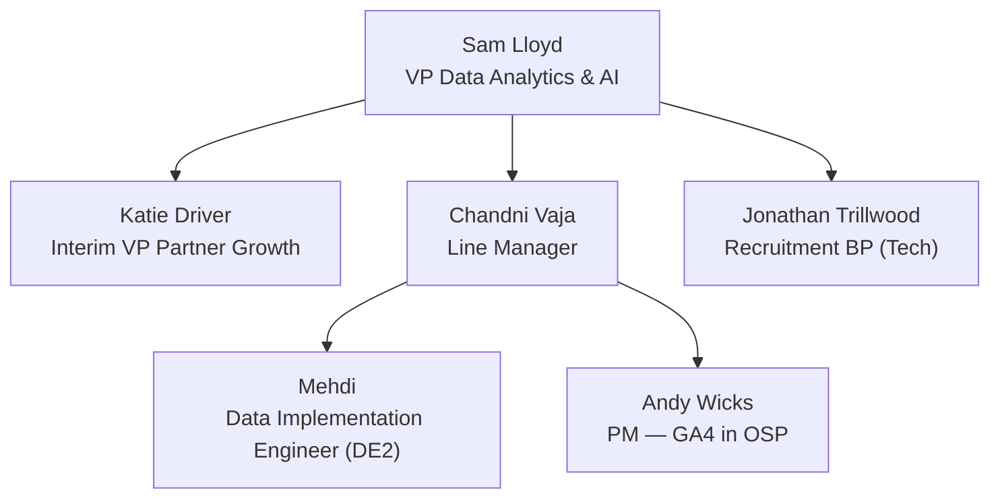

---
tags:
  - memory
  - stakeholders
created: 2026-10-02
updated: 2026-10-02
---

# Stakeholders

## Org Chart (Simplified)

## Key People

| Person | Role | Relationship | Notes |
|---|---|---|---|
| **Sam Lloyd** | VP Data Analytics & AI | Department head (skip-level) | Interviewed Stage 3 (values). Warm, commercially focused. |
| **Katie Driver** | Interim VP Partner Growth | Cross-functional peer leader | Interviewed Stage 3. Works closely with Sam and Ecom Analysts. |
| **Chandni Vaja** | Line Manager | Direct manager | Ran Stage 1 & 2 interviews. Will lead onboarding & assign a buddy. |
| **Andy Wicks** | PM — GA4 in OSP Technology | Primary technical counterpart | Technical interviewer (Stage 2). Owned GA4 implementation since 2022. **Explicitly said he needs hands-on GA4/app expertise to lean on.** |
| **Jonathan Trillwood** | Recruitment Business Partner (Tech) | HR/Admin contact | Handled offer, negotiation, and Day 1 logistics. |

## Working Relationships to Build

- [ ] Establish 1:1 cadence with Chandni (weekly)
- [ ] Schedule intro with Andy to understand current GA4 architecture
- [ ] Meet the Ecom Analysts team Katie works with
- [ ] Identify the buddy Chandni will assign

---

See also: [[Memory_Role_Context]] | [[Memory_Partner_Map]]
